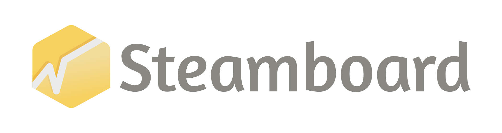

# Steamboard, own your Steam revenue data

Keep your financial data local, private and automatically up to date.
Export them into multiple formats and get prettier dashboards.

Steamboard is a free & open-source software.

Check out the [website](https://steamboard.app) for more information.

## Download & install

Steamboard is available for Windows, macOS and Linux. For easier installation, you can find this software on [Steam](https://store.steampowered.com/app/3902810/Steamboard/) or the [App Store](https://apps.apple.com/us/app/steamboard/id6749637747).

Source code is available on [GitHub](https://github.com/fatfish-lab/steamboard), binaries are available on [GitHub Releases](https://github.com/fatfish-lab/steamboard/releases).

Once the app is installed, you will need to get your Steam Financial API key. Find out more in the [documentation](https://github.com/fatfish-lab/steamboard/wiki).

## Documentation

Documentation is available on [Github, in the wiki section](https://github.com/fatfish-lab/steamboard/wiki).

## Support

If you need help, check our [support page](https://steamboard.app/#support). You will be able to join our community on Discord or get business support.

## License
Steamboard is licensed under the [GNU General Public License v3.0](LICENSE).
